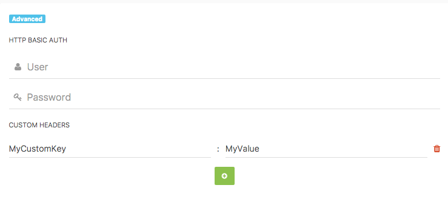

uid: pid-57cd7de46c809
type: documentation/page
created: 2016-09-05 14:15:00
modified: 2016-09-05 14:15:00
title: Webhooks
sort: 6

===

A webhook is a user-defined HTTP callback. It is a mechanism that sends real-time information to any third-party app or service.

Webhooks allow you to specify a URL to which you would like Cockpit to post data when an event happens. So, for instance, if you wish to be notified every time a new collection entry is created, you can create a webhook for it. Webhooks can be created for almost all events in Cockpit.

### Create a webhook

### Advanced options

All data will be send as _application/json_.

### Using POST-data in the webhook destination script

Some hooks send data along with the hook (like some of the collection event hooks which send the fresh new collection's name and configuration).

The data is posted to the webhook destination script in RAW-Post format. So the global var _**$\_POST**_ won't contain any data.

Put _**$\_POST = file_get_contents("php://input")['args']**_ to the beginning of your webhook destination script in order to use the _**$\_POST**_ var like regularly expected.

### Concrete list of events (complete as of august 2018)

- _admin.dashboard.widgets_
- _cockpit.filestorages.init_
- _cockpit.bootstrap_
- _cockpit.media.upload_
- _cockpit.media.removefiles_
- _cockpit.media.rename_
- _cockpit.update.before_
- _cockpit.update.after_
- _cockpit.clearcache_
- _cockpit.export_
- _cockpit.import_
- _cockpit.assets.list_
- _cockpit.assets.save_
- _cockpit.assets.remove_
- _cockpit.rest.init_
- _cockpit.rest.authenticate_
- _cockpit.rest.erroronrequest_
- _collections.createcollection_
- _collections.updatecollection_
- _collections.removecollection_
- _collections.find.before_
- _collections.find.after_
- _collections.save.before_
- _collections.save.after_
- _collections.remove.before_
- _collections.remove.after_
- _forms.save.before_
- _forms.save.after_
- _regions.save.after_
- _regions.remove_
- _regions.render.before_
- _regions.render.after_
- _singleton.save.after_
- _singleton.remove_
- _singleton.saveData.before_
- _singleton.saveData.after_
- _singleton.getData.after_

from views:
- _cockpit.account.editview_
- _admin.dashboard.top_
- _admin.dashboard.bottom_
- _app.layout.header_
- _cockpit.menu.aside_
- _cockpit.menu.main_
- _app.layout.contentbefore_
- _app.layout.contentafter_
- _app.layout.footer_
- _cockpit.view.settings.item_
- _cockpit.view.settings_
