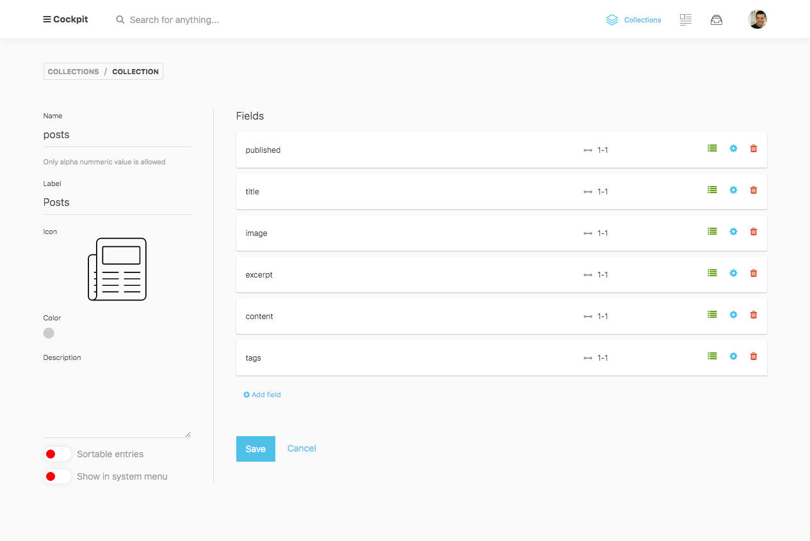
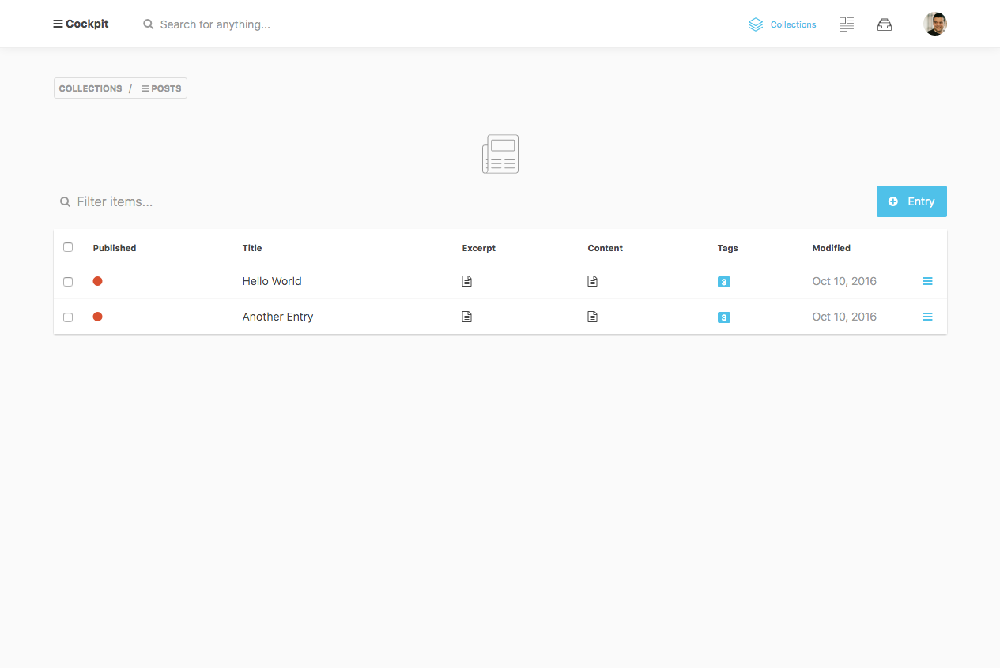
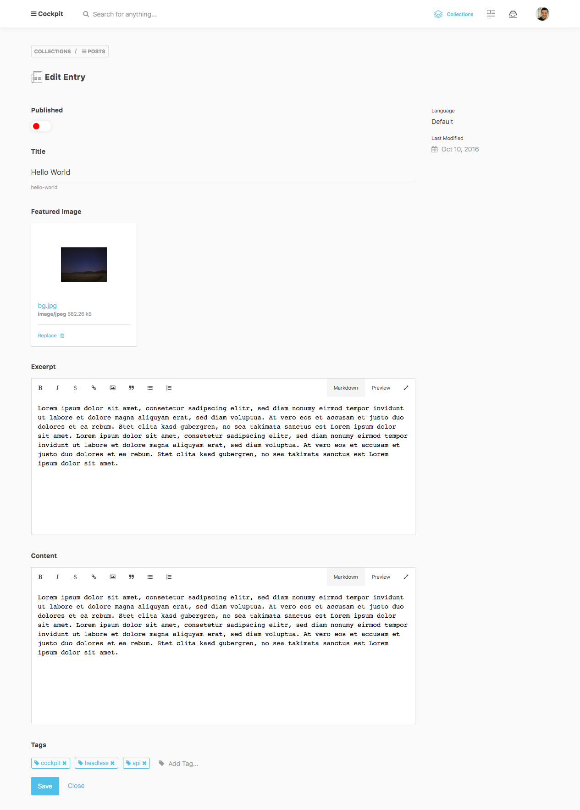

uid: pid-57cc94a392bc4
type: documentation/page
created: 2016-09-04 21:39:47
modified: 2016-09-05 15:50:05
title: Collections
sort: 0

===

Collections is a powerful feature that comes with Cockpit.
With collections you can manage different types of content lists.

> If you're familiar with WordPress, you can compare collections to post types
> or as a simple Content Construction Kit (CCK) you have maybe experienced in systems like Drupal.


## Create a Collection



Define a set of fields which define your desired content model and start collecting items.

## List collection items



## Edit a collection item



You will get an easy to use entry form to manage your content items.

## API

### /api/collections/collection/{collectionname}

Get collection schema

```javascript
fetch('/api/collections/collection/posts?token=xxtokenxx')
    .then(collection => collection.json())
    .then(collection => console.log(collection));
```

### /api/collections/get/{collectionname}

Get collection entries

```javascript
fetch('/api/collections/get/posts?token=xxtokenxx')
    .then(res => res.json())
    .then(res => console.log(res));
```

```javascript
fetch('/api/collections/get/posts?token=xxtokenxx', {
    method: 'post',
    headers: { 'Content-Type': 'application/json' },
    body: JSON.stringify({
        filter: {published:true},
        limit: 10,
        skip: 5,
        sort: {_created:-1},
        populate: 1 // resolve linked collection items
    }))
    .then(res=>res.json())
    .then(res => console.log(res));
```


### /api/collections/save/{collectionname}

Create / Update collection collection entries

```javascript
fetch('/api/collections/save/posts?token=xxtokenxx', {
    method: 'post',
    headers: { 'Content-Type': 'application/json' },
    body: JSON.stringify({
        data: {...}
    }))
    .then(res=>res.json())
    .then(entry => console.log(entry));
```