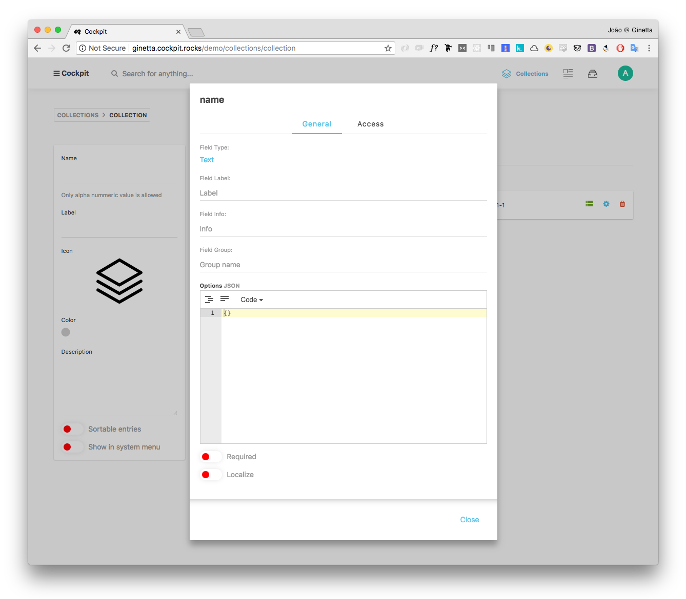

uid: pid-57cc94a392bc4
type: documentation/page
created: 2016-09-04 21:39:47
modified: 2016-09-05 15:50:05
title: Collections
sort: 0

===

Difficulty: Easy ⭐

- [Create a Collection](#create-a-collection)
	- [Collection Info](collection-info) 
	- [Collection Fields](collection-fields) 
- [List collection items](#list-collection-items)
- [Edit a collection item](#edit-a-collection-item)


A **Collection** is an abstraction to store structured content. A collection is defined by its **fields** (how is the collections structured), **items** and **permissions** (you can find detailed documentation on permissions in the [Permissions Page](link-to-permission). One example of a collection would be a collection named **Members**, used to store members of a company.

## Create a Collection

To create a collection, either click the "plus" button or "Create a collection" from the dashboard. Alternatively, you can also created from the collections overview page.


On the collection view, you are presented with two parts: **Collection Info** and **Collection Fields**.


### Collection Info

Start by filling the collection info by defining:

* **Name**: the name of the collection. This should be a computer friendly name as this will be used to retrieve the collection data throught the api. For this example, we'll call it **members**.
* **Label**: (optional) human-friendly name that will appear on the Cockpit Admin UI.
* **Icon**: (optional) a pictogram to easily identify the collection on the Cockpit Admin UI.
* **Color**: (optional) a color to easily idenfity the collection on the Cockpit Admin UI.
* **Description**: (optional) a short description of what is the collection used.
* **Sortable entries**: (TODO)
* **Show in system menu**: (TODO)

### Collection Fields

The fields of a collection is the structured of the collection items. This includes what properties each item should have, validation rules for those properties, and some hints that help content editors create/edit collection items.

In this example, we'll add two fields:

* A field called `name`, of type `Text`, required.
* A field called `role`, of type `Text`, translatable.

In order to do that, click on **Add Field**, as shown in the following screenshot:


A new field will be shown on the fields. After defining a unique, computer-friendly, **field name** on this view, you can click on the **cog** button to further configure the field. The field details will appear in a modal.



Here you can define the following information:

* **Field Type**: the type of the field. Read more on what types are available on the [Field Type Page](link-to-field-type-page). In exemple we want the type to be of `Text`.
* **Field Label**: (optional) human-friendly name to appear on the Admin UI.
* Field Info: (optional) a short description on the field.
* **Field Group**: (optional) it's common to group fields together so that they appear groupped in one tab while inserting/editing one item.
* **Options**: (optional) a JSON object representing the field options. The available options depends on the **Field Type**. You can find a full reference of the available field type options in the [Field Type Page](link-to-field-type-page).
* **Required**: if the field is required or not (if marked as required, cockpit will not allow items to be created without a valid valid for this field both on the Admin UI and throught he API).
* **Localize**: if the field is localized, the item field value can change from language to language. More about localization in the [Internatiolazation Page](i18n-page).

Below a screenshot of two fields we created and their configuration:


Once you're finished configuring the collection, click the **Save** button to create a collection. If you go back to the dashboard, you can see that the collection was successfully created.


## Create a collection item

Once you created and configured a collection, you'll be able to add items to that collection. You can do that by going to that collection view. 

As you just created this collection, it is empty.  To add a new item to the collection, click **Create an entry**.


You'll be presented to the members item view, which includes form with the fields you just configured - **name** and **role** fields as empty text fields.


To create an item, simply fill this form and click the **Save** button.


If you go back to the Members collection page, you can verify that the item was successfully created.


## List collection items

(TODO)


## Edit a collection item

(TODO)


You will get an easy to use entry form to manage your content items.

## API

### /api/collections/collection/{collectionname}

Get collection schema

```javascript
fetch("/api/collections/collection/posts?token=xxtokenxx")
  .then(collection => collection.json())
  .then(collection => console.log(collection));
```

### /api/collections/get/{collectionname}

Get collection entries

```javascript
fetch("/api/collections/get/posts?token=xxtokenxx")
  .then(res => res.json())
  .then(res => console.log(res));
```

```javascript
fetch('/api/collections/get/posts?token=xxtokenxx', {
    method: 'post',
    headers: { 'Content-Type': 'application/json' },
    body: JSON.stringify({
        filter: {published:true},
        limit: 10,
        skip: 5,
        sort: {_created:-1},
        populate: 1 // resolve linked collection items
    }))
    .then(res=>res.json())
    .then(res => console.log(res));
```

### /api/collections/save/{collectionname}

Create / Update collection collection entries

```javascript
fetch('/api/collections/save/posts?token=xxtokenxx', {
    method: 'post',
    headers: { 'Content-Type': 'application/json' },
    body: JSON.stringify({
        data: {...}
    }))
    .then(res=>res.json())
    .then(entry => console.log(entry));
```
