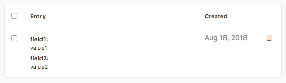

uid: pid-57cc94b7f4081
type: documentation/page
created: 2016-09-04 21:40:07
modified: 2016-09-05 15:54:46
title: Forms
sort: 1

===

Forms are a great way to receive input from your users. It is usually painful to set up a server-side form processing script, and that's where Cockpit forms come to help.

Cockpit offers you a way of gathering form submissions as entries that can be viewed in the dashboard.

It is important to note that Cockpit forms does not process HTML forms natively. You must submit forms via an API POST call to the `/api/forms/submit/{form-name}?token=xxx` endpoint and provide a token with rights to submit the form.

The body of the POST call must be a JSON object with a `form` property. The object in the `form` property is what will be stored as an entry field. There is no schema, no constraints.

```json
{
	"form": {
		"field1": "value1",
		"field2": "value2"
	}
}
```



## Validation

You can write custom validation for your forms by writing a PHP script in a file with the same name as the form and placing it inside the **config/forms** directory.

The success of the validation is determined by the returning a **true** or **false** value from the script.

The submitted form data is available in the `$data` variable. You can do custom checks and even add or remove additional information if required.

```php
if ($data["field1"] != "value1") {
	return false;
}

return true;
```

## API

### /api/forms/submit/{form_name}

Stores the submission of a form as an entry.

```javascript
fetch('/api/forms/submit/cockpitForm?token=xxtokenxx', {
    method: 'post',
    headers: { 'Content-Type': 'application/json' },
    body: JSON.stringify({
        form: {
            field1: 'value1',
            field2: 'value2'
        }
    })
})
.then(entry => entry.json())
.then(entry => console.log(entry));
```