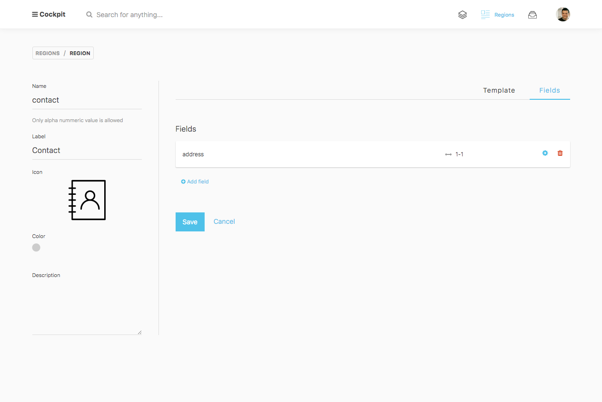
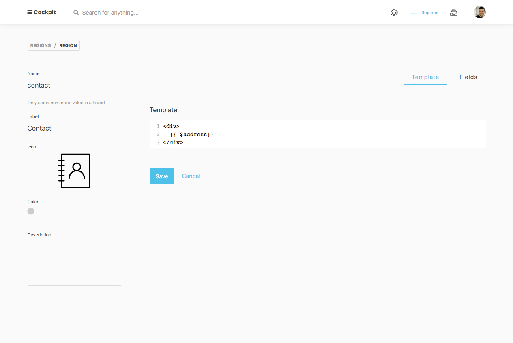
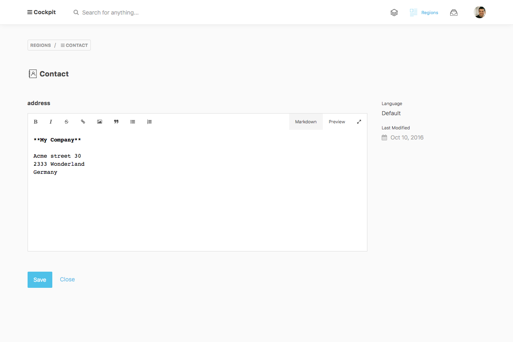

uid: pid-57cc94ada99f0
type: documentation/page
created: 2016-09-04 21:39:57
modified: 2016-09-05 15:54:20
title: Regions
sort: 2

===

Regions are editable content and code snippets which you can re-use everywhere on your website.

## Region Fields

Manage region fields in the field-manager and re-use them in the region template code.

## Region Template

Define a template code. You've access to every region field defined in the region field-manager.
Every template will be parsed on the server and the result will be returned as a string value.

You can also write PHP code for e.g. looping over field values.

## Region Entry Form

Content editors will get an easy to use form to manage the region data.
